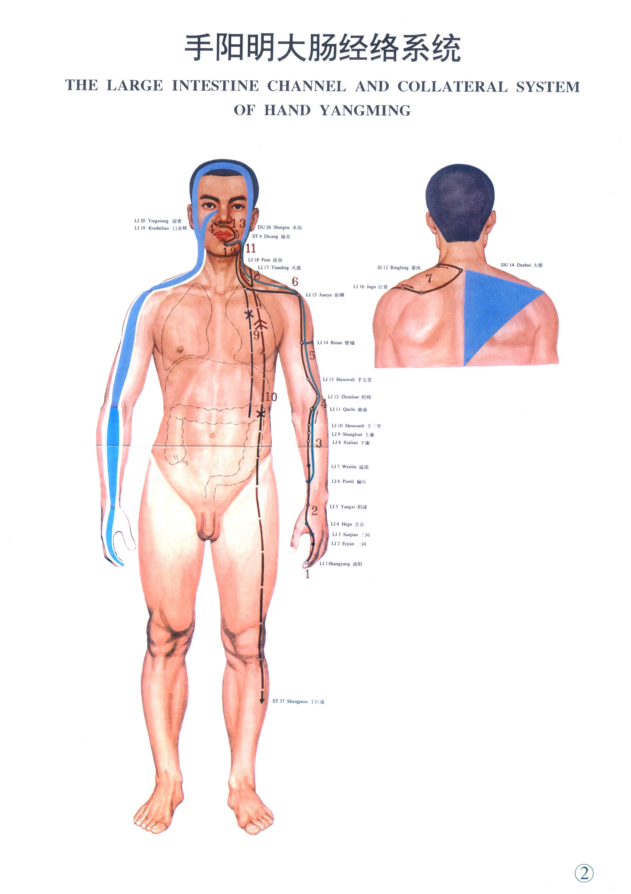

# 手阳明大肠经



## 包含穴位

- [[商阳]]，[[井穴]]
- [[二间]]，[[荥穴]]
- [[三间]]，[[输穴]]
- [[合谷]]，[[原穴]]
- [[阳谿]]，[[经穴]]
- [[偏历]]，[[络穴]]
- [[温溜]]，[[郄穴]]
- [[下廉]]
- [[上廉]]
- [[手三里]]
- [[曲池]]，[[合穴]]
- [[肘髎]]
- [[手五里]]
- [[臂臑]]
- [[肩髃]]
- [[巨骨]]
- [[天鼎]]
- [[扶突]]
- [[禾髎]]
- [[迎香]]


## 查看

```{toctree}
商阳
二间
三间
合谷
阳谿
偏历
温溜
下廉
上廉
手三里
曲池
肘髎
手五里
臂臑
肩髃
巨骨
天鼎
扶突
禾髎
迎香
```